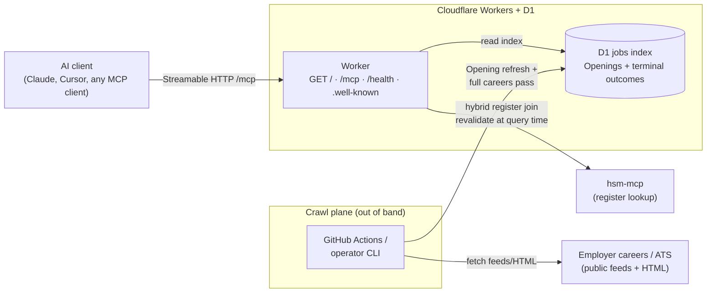

# hsm-jobs-mcp

MCP server that answers which [IND recognised sponsors](https://ind.nl/en/public-register-recognised-sponsors/public-register-work) (Work) have **Openings** on their own careers and ATS pages — layer 2 only. It wraps register lookup via [hsm-mcp](https://github.com/CodeAlanDebug/hsm-mcp); it does not clone register search.

Live discovery: **[https://hsmjobs.musavvir.work](https://hsmjobs.musavvir.work)** (`GET /`, `/mcp`, `/health`).

Agent workflow for this repo: see [`AGENTS.md`](AGENTS.md).

## What it is

- **Openings** indexed out of band from first-party careers/ATS surfaces (not LinkedIn, not a job-board aggregator).
- **Register join** on each card: registered name, KvK, and match strength — never a yes/no “this vacancy will sponsor you” verdict.
- **Honesty fields** on each Opening: salary signal, Dutch-required, sponsorship willingness — separate signals; `unknown` is valid.
- **Index scope** on every jobs-tool response so empty results on a partial index cannot read as “nothing exists anywhere.”

Register-only questions (“is Adyen a recognised sponsor?”, KvK lookup, register freshness) belong on **hsm-mcp**, not here.

## Tools (v1)

| Tool | What it does |
| ---- | ------------ |
| `search_jobs` | Openings at recognised sponsors by title/free text or 8-digit KvK; optional `location`; `limit` default 10, max 20. |
| `get_job` | One Opening by its primary careers or ATS URL; structured `found: false` when absent. |
| `get_index_status` | Jobs-index health, crawl freshness, index scope (`partial` vs `full_careers_pass`), and register-join upstream note. |

Transport: **Streamable HTTP** (`serverInfo.name`: `hsm-jobs-mcp`). Optional stdio exists for local/private-release prototypes only.

Hosting: Cloudflare Workers + D1; crawl plane via scheduled GitHub Actions and/or operator CLI (see [ADR 0009](docs/adr/0009-v1-stack-and-hosting.md)).

## Use / Connect

Attach **both** servers — jobs here, register on hsm-mcp:

**Claude Code**

```bash
claude mcp add --transport http hsm-jobs https://hsmjobs.musavvir.work/mcp
claude mcp add --transport http ind-sponsors https://hsm.codealan.com/mcp
```

**claude.ai / Claude Desktop** — Settings → Connectors → Add custom connector → `https://hsmjobs.musavvir.work/mcp` (and add hsm-mcp separately).

**Any MCP client** (Cursor, etc.)

```json
{
  "mcpServers": {
    "hsm-jobs": { "url": "https://hsmjobs.musavvir.work/mcp" },
    "ind-sponsors": { "url": "https://hsm.codealan.com/mcp" }
  }
}
```

No auth in v1. Rate limits follow the live deploy when present; additional limiting may be added later.

### Local / private release

Dogfood on your machine against a **partial index** — same D1 schema as shared release, but you run crawl and dev locally. Every jobs-tool response must carry **index scope**; `private-release:verify` checks this. Attach **both** MCP servers: jobs here, register on **hsm-mcp** (same pairing as shared connect above).

**Do not point your MCP client at `https://hsmjobs.musavvir.work/mcp` for private dogfood.** Shared `/mcp` returns **503** until a **full careers pass** completes. Use localhost Streamable HTTP from `wrangler dev` instead.

#### Env contract

Copy [`.env.example`](.env.example) to `.env`. Cloudflare bootstrap keys are for deploy; private-release keys default for local use.

| Variable | Default | Purpose |
| -------- | ------- | ------- |
| `JOBS_INDEX_TARGET` | `local-d1` | Where crawl writes the jobs index (`local-d1`, `sqlite:<path>`; `remote-d1` not implemented in this slice) |
| `JOBS_INDEX_LOCAL_D1_STATE` | `.wrangler/state` | Wrangler `--persist-to` root (project-relative path to local D1 persistence) |
| `PRIVATE_RELEASE_ORIGIN` | `http://127.0.0.1:8787` | Base URL for verify and for wiring your MCP client |
| `PRIVATE_RELEASE_PORT` | `8787` | Local dev port (`private-release:integration` may pick a free port when unset) |

Operator loop reuses `.wrangler/state` unless you override `JOBS_INDEX_LOCAL_D1_STATE`. CI uses an **ephemeral** state dir (temp under the OS tmp) and tears it down after verify.

#### Operator loop (crawl → dev → verify)

```bash
npm ci
npm run crawl                  # live fetch → local D1 (partial index)
npm run dev                    # wrangler dev — separate terminal
npm run private-release:verify # Streamable HTTP checks on localhost /mcp
```

Smoke/fixture crawl (no live network): `npm run crawl:smoke`. Full careers pass (shared-release gate): `npm run crawl:full-pass`.

One-shot automated loop (crawl → ephemeral D1 → dev → verify → teardown): `npm run private-release:integration`.

#### Connect locally (Streamable HTTP)

```json
{
  "mcpServers": {
    "hsm-jobs": { "url": "http://127.0.0.1:8787/mcp" },
    "ind-sponsors": { "url": "https://hsm.codealan.com/mcp" }
  }
}
```

If `wrangler dev` binds another port, set `PRIVATE_RELEASE_ORIGIN` (and the client URL) to match.

#### CI verification

Every PR runs the live private-release loop in [`.github/workflows/private-release-integration.yml`](.github/workflows/private-release-integration.yml) (`npm run private-release:integration`). Use `npm run private-release:verify` locally after `dev` is up — same checks CI runs against `/mcp`.

## Example asks

- *"Which recognised sponsors are hiring product designers?"*
- *"Which recognised sponsors are hiring software engineers in Amsterdam?"*
- *"What Openings do you have for KvK 60733144?"*
- *"How fresh is the jobs index?"* (hits `get_index_status`)
- *"Is Adyen a recognised sponsor?"* → use **hsm-mcp** / `ind-sponsors`, not this server.

`get_job` is for when you already have an Opening URL from a prior `search_jobs` hit or an employer careers page — there is no separate “paste a URL” example ask on the discovery page.

## Reading the answers

- **Honesty fields stay separate.** `honesty_salary`, `honesty_dutch_required`, and `honesty_sponsorship_willingness` are independent; `unknown` is valid and common.
- **Register join is match strength**, not a verdict. `exact_kvk` / `strong_name` / `weak` / `unmatched` describe how the Opening ties to the register — recognised sponsor status on the company does not mean this vacancy will sponsor your **HSM transfer**.
- **No salary-criterion check here.** This server does not compare pay to the IND **salary criterion**; you or your agent do.
- **Empty ≠ exhaustive.** On a `partial` index, `omissions_possible` may be true — thin or empty `search_jobs` results are not proof that no Openings exist. On `full_careers_pass`, a miss is relevance, not a coverage gap.
- **Upstream degrade.** When **hsm-mcp** is down or rate-limited at query time, register joins may be stale; the tool surfaces that instead of inventing a stronger join.

Coarse deploy health: `GET /health` (`up` | `degraded` | `stale`). Rich scope and crawl detail: `get_index_status`.

Always confirm important decisions against primary sources — employer careers pages and the [official IND register](https://ind.nl/en/public-register-recognised-sponsors/public-register-work).

## Architecture



| Path | What happens |
| ---- | ------------ |
| `GET /` | Human discovery page (connect, tools, example asks) |
| `GET /.well-known/mcp.json` | MCP server card (SEP-2127-style machine discovery) |
| `GET /.well-known/mcp/server-card.json` | Same server card (SEP-1649 path alias) |
| `/mcp` | Streamable HTTP → `search_jobs` · `get_job` · `get_index_status` |
| `/health` | Coarse operator/CI health (`up` / `degraded` / `stale`) |
| Crawl | scheduled job or operator CLI → D1 (not inside tool calls) |
| Monitoring | `/health` probe + `get_index_status` + alert on repeated crawl failure |

Unofficial project. Openings © respective employers; register data © IND via hsm-mcp. Verify against primary sources before acting.
