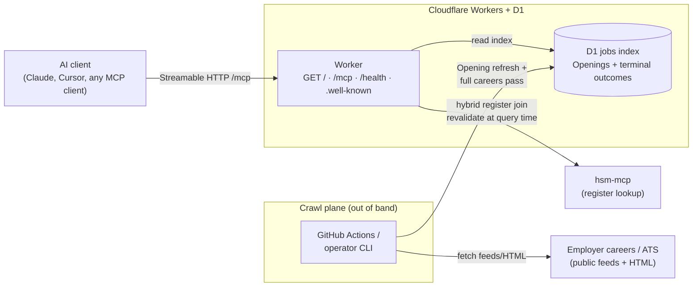

# hsm-jobs-mcp

Remote MCP server that indexes **Openings** on careers and ATS pages of
[IND recognised sponsors (Work)](https://ind.nl/en/public-register-recognised-sponsors/public-register-work)
— Dutch organisations licensed for work / highly skilled migrant permits — and
makes those openings queryable by AI assistants.

It does **not** scrape LinkedIn or big job boards. Each Opening card carries
**register join** (name, KvK, match strength) plus **honesty fields** (salary
signal, Dutch-required, sponsorship willingness). **Unknown** is a valid answer.

For register-only questions — *Is Adyen a recognised sponsor?* — use
**[hsm-mcp](https://github.com/CodeAlanDebug/hsm-mcp)** instead. Attach **both**
servers for a full picture.

Live site: **[https://hsmjobs.musavvir.work](https://hsmjobs.musavvir.work)**

## Use

Connect the jobs server (no auth in v1) **and** hsm-mcp:

**Public `/mcp` — coming soon** until **shared release** (full careers pass).
Until then, shared `/mcp` returns 503; use [Local / private release](#local--private-release) below.

**Claude Code**

```bash
claude mcp add --transport http hsm-jobs https://hsmjobs.musavvir.work/mcp
claude mcp add --transport http ind-sponsors https://hsm.codealan.com/mcp
```

**claude.ai / Claude Desktop** — Settings → Connectors → Add custom connector →
`https://hsmjobs.musavvir.work/mcp` (and add hsm-mcp separately).

**Any MCP client** (Cursor, etc.)

```json
{
  "mcpServers": {
    "hsm-jobs": { "url": "https://hsmjobs.musavvir.work/mcp" },
    "ind-sponsors": { "url": "https://hsm.codealan.com/mcp" }
  }
}
```

Then ask in plain language — the assistant calls the tools itself:

- *"Which recognised sponsors are hiring product designers?"*
- *"Which recognised sponsors are hiring software engineers in Amsterdam?"*
- *"What Openings do you have for KvK 60733144?"*
- *"How fresh is the jobs index?"* (hits `get_index_status`)
- *"Is Adyen a recognised sponsor?"* → ask **hsm-mcp**, not this server

### Local / private release

Until shared unlocks, run on your machine (Node.js 20+):

```bash
git clone https://github.com/musavvirahmed/hsm-jobs-mcp.git
cd hsm-jobs-mcp
npm ci
npm run crawl
npm run dev   # leave running; default http://127.0.0.1:8787
```

Point `hsm-jobs` at `http://127.0.0.1:8787/mcp` (still pair `ind-sponsors`).
Operator detail: [docs/README-developers.md](docs/README-developers.md).

## The three tools

| Tool | What it does |
| ---- | ------------ |
| `search_jobs` | Search Openings by title or company (KvK). Optional location. Up to 20 results. |
| `get_job` | Full details for one Opening URL. |
| `get_index_status` | Jobs-index freshness and **index scope**. |

## How to read the answers

- **Honesty fields are separate.** Salary, Dutch-required, and sponsorship willingness are independent. Unknown is common and valid.
- **Register join is match strength, not a yes/no.** A company on the register does not mean this vacancy will sponsor your **HSM transfer**.
- **This server does not check the IND salary criterion.** You or your agent must.
- **Empty results may not mean “no Openings”.** On a **partial index**, check **index scope** (`omissions_possible`).
- **Register data can be stale.** If hsm-mcp is slow or down, cards keep last-known join and say so.

Always confirm against employer careers pages and the
[official IND register](https://ind.nl/en/public-register-recognised-sponsors/public-register-work).

## Architecture



| Path | What happens |
| ---- | ------------ |
| `GET /` | Human discovery page (connect, tools, example asks) |
| `GET /.well-known/mcp.json` | MCP server card (SEP-2127-style machine discovery) |
| `GET /.well-known/mcp/server-card.json` | Same server card (SEP-1649 path alias) |
| `/mcp` | Streamable HTTP → `search_jobs` · `get_job` · `get_index_status` |
| `/health` | Coarse operator/CI health (`up` / `degraded` / `stale`) |
| Crawl | scheduled job or operator CLI → D1 (not inside tool calls) |
| Monitoring | `/health` probe + `get_index_status` + alert on repeated crawl failure |

Key design points: tools **read** a durable **jobs index** — never scrape inside a tool call; crawl runs out of band; every jobs response carries **index scope**; **shared release** waits for a **full careers pass**; register-only lookup stays on **hsm-mcp**.

Transport: **Streamable HTTP** (`serverInfo.name`: `hsm-jobs-mcp`). Hosting: Cloudflare Workers + D1. Stack lock: [ADR 0009](docs/adr/0009-v1-stack-and-hosting.md).

Operator runbook, env contract, and CI: [docs/README-developers.md](docs/README-developers.md).

Unofficial project. Openings © respective employers. Register data © IND via hsm-mcp.
