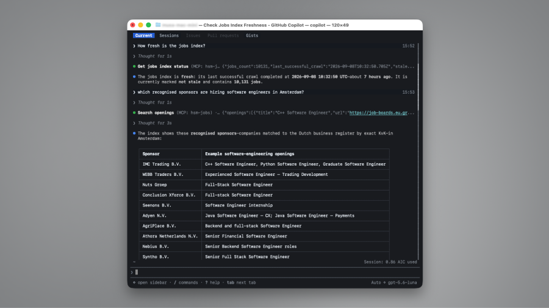
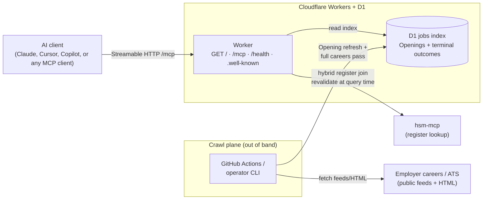

# hsm-jobs

What if you could simply ask your AI (model of choice) which [Dutch recognised sponsors](https://ind.nl/en/public-register-recognised-sponsors/public-register-work) are hiring? This remote MCP server will do exactly that. It will find you job openings by those recognised sponsors, and present them to you in an easy-to-read way.



## Step 1 of 2: Connect to the MCP server

**If you use Claude Code:**

```bash
claude mcp add --transport http hsm-jobs https://hsmjobs.musavvir.work/mcp
```

**If you use GitHub Copilot CLI:**

```bash
copilot mcp add --transport http hsm-jobs https://hsmjobs.musavvir.work/mcp
```

**Or if you use any other AI-IDE, try applying this setting:**

```json
{
  "mcpServers": {
    "hsm-jobs": { "url": "https://hsmjobs.musavvir.work/mcp" }
  }
}
```

Note: if you have questions such as "Is Booking.com a recognised sponsor?" then you must use this other [hsm-mcp](https://github.com/CodeAlanDebug/hsm-mcp) server.

## Step 2 of 2: Then just ask

- "Which recognised sponsors are hiring product designers?"
- "Which recognised sponsors are hiring software engineers in Amsterdam?"
- "What Openings do you have for KvK 60733144?"
- "How fresh is the jobs index?"

## What does 'how fresh' mean?

The IND Work register lists  ~**13,000** recognised sponsor companies. This server does **not** scrape those careers pages real-time when you ask. It answers from a shared **jobs index** that a crawler updates in the background.

That jobs index must stay current because - the register can change (sponsors can be added or removed), employers post and remove openings on their own website or 3rd-party ATS pages, and job openings in the jobs index can outlive the live posting until the crawler re-checks that board.

After a full careers pass, every current register sponsor has been checked at least once. Only a few hundred typically have Openings in the jobs index at once; the rest were checked and had none (or no usable public board).

Maintenance is roughly **daily**: re-check a capped slice of known boards (boards with openings first), and attempt any new register sponsors that still lack an outcome. Not every board is refreshed every day, so some postings can stay in the jobs index for several days after they disappear on the employer site.

Ask `get_index_status` for the current last successful crawl time, stale flag, jobs count, and index scope.

## Besides 'just asking', what else can you do?


| Built-in tool you can call | What it does                                                                          |
| -------------------------- | ------------------------------------------------------------------------------------- |
| `search_jobs`              | Openings at recognised sponsors by title/free text or 8-digit KvK; optional location. |
| `get_job`                  | One Opening by its primary careers or ATS URL; returns structured miss when absent.   |
| `get_index_status`         | Jobs-index health, crawl freshness, and index scope (partial vs full careers pass).   |

---

## Learn about the architecture




| Path      | What happens                                                                                          |
| --------- | ----------------------------------------------------------------------------------------------------- |
| `/`       | this discovery page                                                                                   |
| `/mcp`    | Streamable HTTP MCP (`serverInfo.name`: `hsm-jobs-mcp`)                                               |
| `/health` | coarse operator health ([https://hsmjobs.musavvir.work/health](https://hsmjobs.musavvir.work/health)) |


More paths, env, and crawl ops: [docs/README-developers.md](docs/README-developers.md). Stack lock: [ADR 0009](docs/adr/0009-v1-stack-and-hosting.md).

## More info for developers

Agent instructions for this repo: [`AGENTS.md`](AGENTS.md)

Operator env contract, crawl schedule, HTTP paths, and CI: [docs/README-developers.md](docs/README-developers.md).

Unofficial project. Openings come from employer careers/ATS pages; register facts come from [IND](https://ind.nl/en/public-register-recognised-sponsors/public-register-work) via [hsm-mcp](https://github.com/CodeAlanDebug/hsm-mcp). Verify against primary sources before acting.
