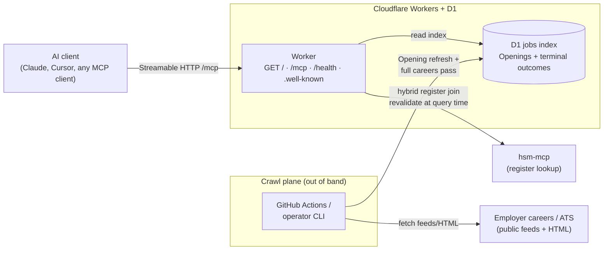

# hsm-jobs-mcp

Ask your AI: *Which recognised sponsors in the Netherlands are hiring for a role I want?*

This MCP server searches **real job listings** on company careers pages. It does **not** search LinkedIn or big job boards.

For register-only questions — *Is Adyen a recognised sponsor?* — also add **[hsm-mcp](https://github.com/CodeAlanDebug/hsm-mcp)**. You need **both** servers for a full picture.

Live site: **[https://hsmjobs.musavvir.work](https://hsmjobs.musavvir.work)**

Agent instructions for this repo: [`AGENTS.md`](AGENTS.md)

---

## Connect (start here)

You do **not** need to clone this repo to try the live server.

Add **two** servers — jobs here, and register lookup on hsm-mcp. No login in v1.

**Cursor / any MCP client**

```json
{
  "mcpServers": {
    "hsm-jobs": { "url": "https://hsmjobs.musavvir.work/mcp" },
    "ind-sponsors": { "url": "https://hsm.codealan.com/mcp" }
  }
}
```

In **Cursor Settings → MCP**, both servers should show green. `hsm-jobs` lists 3 tools. `ind-sponsors` lists 2 tools.

**Cursor: use This Mac / desktop, not Cloud.** Green servers in **Settings → MCP** apply to local Agent chats. A chat set to **Cloud** often skips those servers and answers from the web. Before you test, open a **new** chat. Set the environment to **This Mac** (or desktop Agent). Cloud Agents need a separate MCP setup in the Cloud Agents dashboard.

**Claude Code**

```bash
claude mcp add --transport http hsm-jobs https://hsmjobs.musavvir.work/mcp
claude mcp add --transport http ind-sponsors https://hsm.codealan.com/mcp
```

**claude.ai / Claude Desktop:** Settings → Connectors → Add custom connector → `https://hsmjobs.musavvir.work/mcp` (add hsm-mcp the same way).

Then start a **new chat** and ask in plain language. You do **not** pick MCP tools from the `/` skills menu. The assistant calls them when it answers.

- *"Which recognised sponsors are hiring product designers?"*
- *"Which recognised sponsors are hiring software engineers in Amsterdam?"*
- *"What jobs do you have for KvK 60733144?"*
- *"How fresh is the jobs index?"*
- *"Is Adyen a recognised sponsor?"* → this hits **hsm-mcp**, not this server

**You know MCP worked when:**

- The reply cites **last successful crawl**, **jobs count**, or **index scope** from the index — not a guess from random websites.
- Cursor shows an MCP **tool** call (for example `get_index_status` or `search_jobs`), or a status like **Explored … 1 tool**.

If the assistant only searches the web, say: *Use the hsm-jobs MCP tool `get_index_status`.*

---

## What it does

- Finds **Openings** — live jobs on employer careers and ATS pages.
- Shows **register join** on each job: company name, KvK number, and how strong the match is. This is **not** a promise that the job will sponsor your visa.
- Shows **honesty fields**: salary info, Dutch language requirement, sponsorship willingness. **Unknown** is a normal answer.
- Shows **index scope** on every answer.

Register-only questions belong on **hsm-mcp**, not here.

## The three tools

| Tool | What it does |
| ---- | ------------ |
| `search_jobs` | Search jobs by title or company (KvK number). Optional location. Returns up to 20 results. |
| `get_job` | Get full details for one job URL. |
| `get_index_status` | Check how fresh the job index is and how complete coverage is. |

## How to read the answers

- **Honesty fields are separate signals.** Salary, Dutch requirement, and sponsorship willingness are independent. Unknown is common and valid.
- **Register join is a match score, not a yes/no.** A company on the sponsor register does not mean this specific job will sponsor you.
- **This tool does not check the IND salary minimum.** You or your agent must do that.
- **Empty results mean no matching openings in the index right now.** The shared index has finished a full careers pass over the current Work register.
- **Each search returns up to 20 hits.** When more matches exist, the answer says so and invites a tighter title or location. When every match fits in the page, it does not talk about a cap.
- **Register data can be stale.** If hsm-mcp is slow or down, job cards may show older register info. The tool tells you instead of guessing.

Check employer careers pages and the [official IND register](https://ind.nl/en/public-register-recognised-sponsors/public-register-work) before you act on anything important.

---

## Architecture



| Path | What happens |
| ---- | ------------ |
| `GET /` | Human discovery page (connect, tools, example asks) |
| `/mcp` | Streamable HTTP → `search_jobs` · `get_job` · `get_index_status` |
| `/health` | Coarse operator health |

More paths, env, and crawl ops: [docs/README-developers.md](docs/README-developers.md). Stack lock: [ADR 0009](docs/adr/0009-v1-stack-and-hosting.md).

---

## Try it on your computer

Use this section only if you want a **local** copy of the index (to develop, or to try the server without the public URL).

The public URL above already serves the shared index. Local `http://127.0.0.1:8787/mcp` is a **different** index on your machine. Point your AI tool at **one** jobs URL at a time.

You need Node.js **20 or newer** (tests use Node 24) and an MCP client (Cursor, Claude Code, or Claude Desktop).

```bash
node --version
npm --version
```

If you see `command not found`, install Node.js from [nodejs.org](https://nodejs.org/) (LTS), then run the commands again.

### Get the code

**Option A — clone (recommended)**

```bash
git clone https://github.com/musavvirahmed/hsm-jobs-mcp.git
cd hsm-jobs-mcp
```

**Option B — download without git**

1. Open [github.com/musavvirahmed/hsm-jobs-mcp](https://github.com/musavvirahmed/hsm-jobs-mcp).
2. Click **Code** → **Download ZIP**.
3. Unzip the file and open a terminal in the unzipped folder.

### Step 1 — Install dependencies

Open a terminal in the project folder (the folder that contains this README).

```bash
npm ci
```

This usually takes about **one minute**.

You will use **two terminals**. Step 2 finishes in the first. Step 3 starts the server in a second terminal and leaves it running. Step 4 uses the first terminal again.

### Step 2 — Download job listings

In the **same** terminal as step 1, run a **fixture** crawl first (seconds to about **one minute**):

```bash
npm run crawl:smoke
```

You will see `[crawl]` status lines while it runs. Wait for the JSON report at the end. There is no progress bar.

`npm run crawl` (without `:smoke`) loads the live register. That run can take **many minutes to hours**. Prefer the shared MCP at `https://hsmjobs.musavvir.work/mcp`. Or keep using `npm run crawl:smoke`. Use the live crawl only when you need a live local index.

### Step 3 — Start the local server

Open a **<u>new</u>** terminal window or tab in the **<u>same</u>** project folder. Run:

```bash
npm run dev
```

Leave this terminal open. The server uses [http://127.0.0.1:8787](http://127.0.0.1:8787) by default. It will keep running until you stop it.

Ready usually takes **under 30 seconds**. The MCP URL is `http://127.0.0.1:8787/mcp`.

### Step 4 — Check that it works

In a terminal that is **not** running `npm run dev` — the one you used for steps 1 and 2 is fine.

```bash
npm run private-release:verify
```

If you see `ready at http://127.0.0.1:8787/mcp`, you are good. This check usually takes **a few seconds**.

If it fails:

1. Make sure step 2 finished without errors.
2. Make sure step 3 is still running in the other terminal.
3. Run step 4 again in a terminal that is not running the server.

### Step 5 — Point your AI tool at localhost

Change **only** the jobs URL to your machine. Keep hsm-mcp on the public register server.

```json
{
  "mcpServers": {
    "hsm-jobs": { "url": "http://127.0.0.1:8787/mcp" },
    "ind-sponsors": { "url": "https://hsm.codealan.com/mcp" }
  }
}
```

```bash
claude mcp add --transport http hsm-jobs http://127.0.0.1:8787/mcp
claude mcp add --transport http ind-sponsors https://hsm.codealan.com/mcp
```

Use localhost here so you talk to **your** index. The public URL talks to the **shared** index. Both work. They are not the same database.

If you skip steps 1–4 and connect to localhost anyway, Cursor will show an error: nothing is listening on port 8787. Connect to `https://hsmjobs.musavvir.work/mcp` instead, or finish steps 1–4 first.

### Step 6 — Ask from this folder

1. In Cursor: **File → Open Folder…**
2. Choose the `hsm-jobs-mcp` folder (the one that contains this README).
3. Start a **new chat** in that window.

If you chat from a different folder, Cursor may search local files instead of calling `hsm-jobs`.

Ask: *How fresh is the jobs index?* You know the **local** server worked when the `npm run dev` terminal prints `POST /mcp 200` (or `202`).

### Optional settings

Copy [`.env.example`](.env.example) to `.env` if you want to change defaults. Most people do not need this for a first try.

| Setting | Default | When to change it |
| ------- | ------- | ----------------- |
| `JOBS_INDEX_TARGET` | `local-d1` | Rarely — keeps job data on your machine |
| `PRIVATE_RELEASE_ORIGIN` | `http://127.0.0.1:8787` | If `npm run dev` uses a different port |

---

## For developers

Operator env contract, crawl schedule, HTTP paths, and CI: [docs/README-developers.md](docs/README-developers.md).

Unofficial project. Job listings © respective employers. Register data © IND via hsm-mcp.
