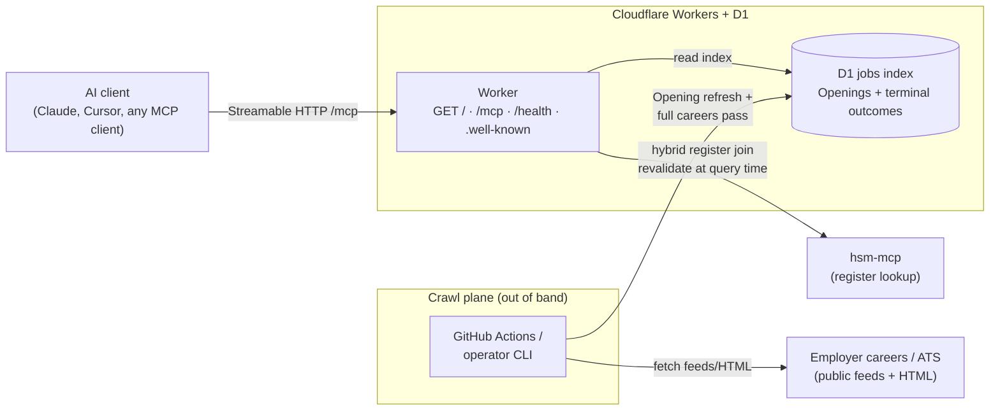

# Developer and operator reference

Human-first setup lives in the [root README](../README.md). This page holds architecture, env contract, and CI detail for operators and agents.

## Local / private release (operator)

Dogfood on your machine against a **partial index** — same D1 schema as shared release, but you run crawl and dev locally. Every jobs-tool response must carry **index scope**; `private-release:verify` checks this. Attach **both** MCP servers: jobs here, register on **hsm-mcp**.

**Do not point your MCP client at `https://hsmjobs.musavvir.work/mcp` for private dogfood.** Shared `/mcp` returns **503** until a **full careers pass** completes. Use localhost Streamable HTTP from `wrangler dev` instead.

### Env contract

Copy [`.env.example`](../.env.example) to `.env`. Cloudflare bootstrap keys are for deploy; private-release keys default for local use.

| Variable | Default | Purpose |
| -------- | ------- | ------- |
| `JOBS_INDEX_TARGET` | `local-d1` | Where crawl writes the jobs index (`local-d1`, `sqlite:<path>`; `remote-d1` not implemented in this slice) |
| `JOBS_INDEX_LOCAL_D1_STATE` | `.wrangler/state` | Wrangler `--persist-to` root (project-relative path to local D1 persistence) |
| `PRIVATE_RELEASE_ORIGIN` | `http://127.0.0.1:8787` | Base URL for verify and for wiring your MCP client |
| `PRIVATE_RELEASE_PORT` | `8787` | Local dev port (`private-release:integration` may pick a free port when unset) |

Operator loop reuses `.wrangler/state` unless you override `JOBS_INDEX_LOCAL_D1_STATE`. CI uses an **ephemeral** state dir (temp under the OS tmp) and tears it down after verify.

### Operator loop (crawl → dev → verify)

```bash
npm ci
npm run crawl                  # live fetch → local D1 (partial index)
npm run dev                    # wrangler dev — separate terminal
npm run private-release:verify # Streamable HTTP checks on localhost /mcp
```

Smoke/fixture crawl (no live network): `npm run crawl:smoke`. Full careers pass (shared-release gate): `npm run crawl:full-pass`.

One-shot automated loop (crawl → ephemeral D1 → dev → verify → teardown): `npm run private-release:integration`.

### CI verification

Every PR runs the live private-release loop in [`.github/workflows/private-release-integration.yml`](../.github/workflows/private-release-integration.yml) (`npm run private-release:integration`). Use `npm run private-release:verify` locally after `dev` is up — same checks CI runs against `/mcp`.

## Architecture



| Path | What happens |
| ---- | ------------ |
| `GET /` | Human discovery page (connect, tools, example asks) |
| `GET /.well-known/mcp.json` | MCP server card (SEP-2127-style machine discovery) |
| `GET /.well-known/mcp/server-card.json` | Same server card (SEP-1649 path alias) |
| `/mcp` | Streamable HTTP → `search_jobs` · `get_job` · `get_index_status` |
| `/health` | Coarse operator/CI health (`up` / `degraded` / `stale`) |
| Crawl | scheduled job or operator CLI → D1 (not inside tool calls) |
| Monitoring | `/health` probe + `get_index_status` + alert on repeated crawl failure |

Transport: **Streamable HTTP** (`serverInfo.name`: `hsm-jobs-mcp`). Optional stdio exists for local/private-release prototypes only.

Hosting: Cloudflare Workers + D1; crawl plane via scheduled GitHub Actions and/or operator CLI (see [ADR 0009](adr/0009-v1-stack-and-hosting.md)).
