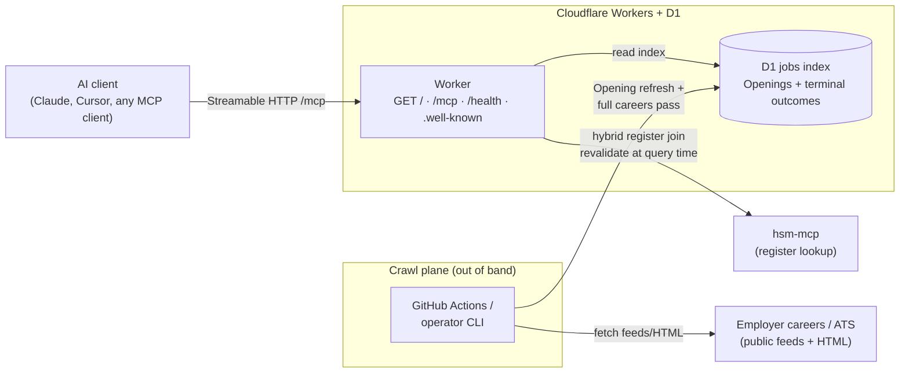

# Developer and operator reference

Human-first setup lives in the [root README](../README.md). This page holds architecture, env contract, and CI detail for operators and agents.

## Local / private release (operator)

Dogfood on your machine against a **partial index** — same D1 schema as shared release, but you run crawl and dev locally. Every jobs-tool response must carry **index scope**; `private-release:verify` checks this. Attach **both** MCP servers: jobs here, register on **hsm-mcp**.

**Do not point your MCP client at `https://hsmjobs.musavvir.work/mcp` for private dogfood.** Shared `/mcp` returns **503** until a **full careers pass** completes. Use localhost Streamable HTTP from `wrangler dev` instead.

### Env contract

Copy [`.env.example`](../.env.example) to `.env`. Cloudflare bootstrap keys are for deploy; private-release keys default for local use.

| Variable | Default | Purpose |
| -------- | ------- | ------- |
| `JOBS_INDEX_TARGET` | `local-d1` | Where crawl writes the jobs index: `local-d1` (private release), `remote-d1` (shared D1 the Worker reads), or `sqlite:<path>` |
| `CLOUDFLARE_ACCOUNT_ID` | — | Required when `JOBS_INDEX_TARGET=remote-d1` (from Cloudflare dashboard) |
| `D1_DATABASE_ID` | — | Required when `JOBS_INDEX_TARGET=remote-d1` (same UUID as `wrangler.jsonc` / bootstrap) |
| `CLOUDFLARE_API_TOKEN` | — | Required when `JOBS_INDEX_TARGET=remote-d1` (D1 edit token) |
| `JOBS_INDEX_LOCAL_D1_STATE` | `.wrangler/state` | Wrangler `--persist-to` root (project-relative path to local D1 persistence) |
| `PRIVATE_RELEASE_ORIGIN` | `http://127.0.0.1:8787` | Base URL for verify and for wiring your MCP client |
| `PRIVATE_RELEASE_PORT` | `8787` | Local dev port (`private-release:integration` may pick a free port when unset) |
| `CRAWL_MAX_ATTEMPTS` | (all missing) | Optional cap on missing KvKs per `crawl:full-pass` |

Operator loop reuses `.wrangler/state` unless you override `JOBS_INDEX_LOCAL_D1_STATE`. CI uses an **ephemeral** state dir (temp under the OS tmp) and tears it down after verify.

### Operator loop (crawl → dev → verify)

```bash
npm ci
npm run crawl                  # live fetch → local D1 (partial index)
npm run dev                    # wrangler dev — separate terminal
npm run private-release:verify # Streamable HTTP checks on localhost /mcp
```

Smoke/fixture crawl (no live network): `npm run crawl:smoke`. Full careers pass (shared-release gate): `npm run crawl:full-pass`.

Production full pass writes to the shared jobs index:

```bash
JOBS_INDEX_TARGET=remote-d1 npm run crawl:full-pass
```

Requires `CLOUDFLARE_ACCOUNT_ID`, `D1_DATABASE_ID`, and `CLOUDFLARE_API_TOKEN` in `.env`. The runner applies remote D1 migrations on first connect, skips KvKs that already have **terminal careers outcomes**, and prints `jobs_index_target: "remote-d1"` in JSON output. Stop with Ctrl+C; re-run the same command to resume.

One-shot automated loop (crawl → ephemeral D1 → dev → verify → teardown): `npm run private-release:integration`.

### CI verification

Every PR runs the live private-release loop in [`.github/workflows/private-release-integration.yml`](../.github/workflows/private-release-integration.yml) (`npm run private-release:integration`). Use `npm run private-release:verify` locally after `dev` is up — same checks CI runs against `/mcp`.

## Shared release (operator)

After the production **full careers pass** completes on remote D1, verify the public origin before pointing MCP clients at it:

```bash
npm run shared-release:verify
```

Default target: `https://hsmjobs.musavvir.work` (override with `SHARED_RELEASE_ORIGIN`). Checks:

- `GET /health` returns 200 JSON (not degraded)
- `POST /mcp` initialize succeeds (not 503)
- `get_index_status` reports `pass: full_careers_pass`, `omissions_possible: false`, and a plausible `register_size`

Unit tests cover verify logic against a local HTTP handler — no live-network dependency on every PR. Run `shared-release:verify` against production manually when the crawl finishes.

### Automated crawl (production schedule)

Two clocks keep the **jobs index** honest after **shared release** (see [ADR 0009](adr/0009-v1-stack-and-hosting.md) and [ADR 0004](adr/0004-partial-index-ship-rule.md)):

| Clock | What | Cadence |
| ----- | ---- | ------- |
| Opening refresh | Re-fetch known board paths; close vanished postings | ~daily (`0 5 * * *` UTC) |
| Register catch-up | Attempt missing **terminal careers outcomes** (IND register delta) | Same run, cap `CRAWL_MAX_ATTEMPTS` (default 200) |

A new Work-register KvK without a terminal outcome sets pass back to `partial`. Catch-up chips away until missing is 0. At 200 KvKs per day, a full ~13k register is about two months; a typical monthly IND delta is much smaller.

The fixture-smoke workflow ([`.github/workflows/crawl.yml`](../.github/workflows/crawl.yml)) stays fixture-only. Production writes use [`.github/workflows/crawl-production.yml`](../.github/workflows/crawl-production.yml). That workflow has **no `pull_request` trigger**. Cron is a no-op until repo variable `ENABLE_PRODUCTION_CRAWL_SCHEDULE` is `true`. Forks never receive production secrets.

Do **not** run a local `JOBS_INDEX_TARGET=remote-d1` crawl while the schedule is on or a production run is in progress.

#### Human operator (after this workflow is on `main`)

`gh` must be authed to `musavvirahmed/hsm-jobs-mcp`. Account ID and D1 UUID are in `.env` / `wrangler.jsonc` (`hsm-jobs-index`) if you already ran bootstrap.

**0. Gate check**

```bash
gh variable list | grep ENABLE_PRODUCTION_CRAWL_SCHEDULE || echo "schedule variable unset (good)"
```

Must be unset or not `true`. Confirm `crawl-production.yml` exists on `main`.

**1. Stop the local writer**

```bash
pgrep -fl 'full-pass-loop|run-crawl' || echo "no local crawl process"
tmux has-session -t crawl 2>/dev/null && echo "tmux crawl session exists" || echo "no tmux crawl session"
```

If a loop is running: `tmux attach -t crawl` then Ctrl+C (or `tmux kill-session -t crawl`). Re-check `pgrep`. Do not restart the local loop until a no-go (step 5) or pause (step 8).

**2. Cloudflare token (if needed)**

Prefer a dedicated Actions token: [API tokens](https://dash.cloudflare.com/profile/api-tokens) → Create Custom Token → **Account → D1 → Edit** (add **Account Settings → Read** only if the dashboard requires it) → this account only. Copy once. Do not paste into chat.

IDs: `grep CLOUDFLARE_ACCOUNT_ID .env`. D1 UUID from `wrangler.jsonc` `database_id` or `grep D1_DATABASE_ID .env`.

**3. Repo secrets**

```bash
gh secret set CLOUDFLARE_ACCOUNT_ID --body "$(grep '^CLOUDFLARE_ACCOUNT_ID=' .env | cut -d= -f2-)"
gh secret set D1_DATABASE_ID --body "$(grep '^D1_DATABASE_ID=' .env | cut -d= -f2-)"
gh secret set CLOUDFLARE_API_TOKEN   # paste when prompted; or: printf '%s' 'TOKEN' | gh secret set CLOUDFLARE_API_TOKEN
gh secret list | egrep 'CLOUDFLARE_ACCOUNT_ID|D1_DATABASE_ID|CLOUDFLARE_API_TOKEN'
```

**4. Pilot dispatch**

```bash
pgrep -fl 'full-pass-loop|run-crawl' || echo "no local crawl process"
gh workflow run crawl-production.yml -f catch_up_max_attempts=200
gh run watch
gh run list --workflow=crawl-production.yml --limit 1
gh run download RUN_ID   # replace RUN_ID
```

Note wall-clock for both jobs.

**5. Go / no-go**

From `catchup-report.json` (and `refresh-report.json`):

| Check | Fail |
| ----- | ---- |
| Jobs green (catch-up may still run after a known refresh fail) | Fix secrets/logs; do not enable schedule |
| `jobs_index_target` is `remote-d1` | Re-check secrets |
| `attempted` ≈ cap (or remaining missing) | Inspect logs |
| `missing_terminal_outcomes_after` ≈ `missing_terminal_outcomes_before - attempted` | Egress suspect → step 8 fallback; do not enable schedule |
| No stale hsm-mcp register error | Fix upstream; do not raise cap |
| `/health` passed | Check Worker / DNS |

Record minutes, `missing_*`, `attempted`, `index_scope.pass`. **Go** → step 6. **No-go** → leave schedule unset.

Skip step 6 and keep dispatching if the initial full pass is still incomplete.

**6. Enable daily schedule (Go only)**

```bash
gh variable set ENABLE_PRODUCTION_CRAWL_SCHEDULE --body true
```

Until then, only `workflow_dispatch` runs production.

**7. Burst catch-up (optional)**

After a large IND register delta: `gh workflow run crawl-production.yml -f catch_up_max_attempts=500`. Do not change the scheduled default to 500 until a 200 (and preferably a 500) dispatch finished inside timeouts.

**8. Pause / local fallback**

```bash
gh variable delete ENABLE_PRODUCTION_CRAWL_SCHEDULE
# or: gh variable set ENABLE_PRODUCTION_CRAWL_SCHEDULE --body false
```

Disable the workflow in the Actions UI to block dispatch too. Local fallback while schedule is off:

```bash
JOBS_INDEX_TARGET=remote-d1 CRAWL_MAX_ATTEMPTS=200 npm run crawl:full-pass
```

**9. Stale register / one writer**

Stale **hsm-mcp**: do not tight-loop dispatch; fix upstream (`HSM_MCP_ORIGIN`, default `https://hsm.codealan.com`), then one `gh workflow run crawl-production.yml`.

Never run a local `JOBS_INDEX_TARGET=remote-d1` crawl while the schedule variable is `true` or a production run is in progress.

## Architecture



| Path | What happens |
| ---- | ------------ |
| `GET /` | Human discovery page (connect, tools, example asks) |
| `GET /.well-known/mcp.json` | MCP server card (SEP-2127-style machine discovery) |
| `GET /.well-known/mcp/server-card.json` | Same server card (SEP-1649 path alias) |
| `/mcp` | Streamable HTTP → `search_jobs` · `get_job` · `get_index_status` |
| `/health` | Coarse operator/CI health (`up` / `degraded` / `stale`) |
| Crawl | scheduled job or operator CLI → D1 (not inside tool calls) |
| Monitoring | `/health` probe + `get_index_status` + alert on repeated crawl failure |

Transport: **Streamable HTTP** (`serverInfo.name`: `hsm-jobs-mcp`). Optional stdio exists for local/private-release prototypes only.

Hosting: Cloudflare Workers + D1; crawl plane via scheduled GitHub Actions and/or operator CLI (see [ADR 0009](adr/0009-v1-stack-and-hosting.md)).
