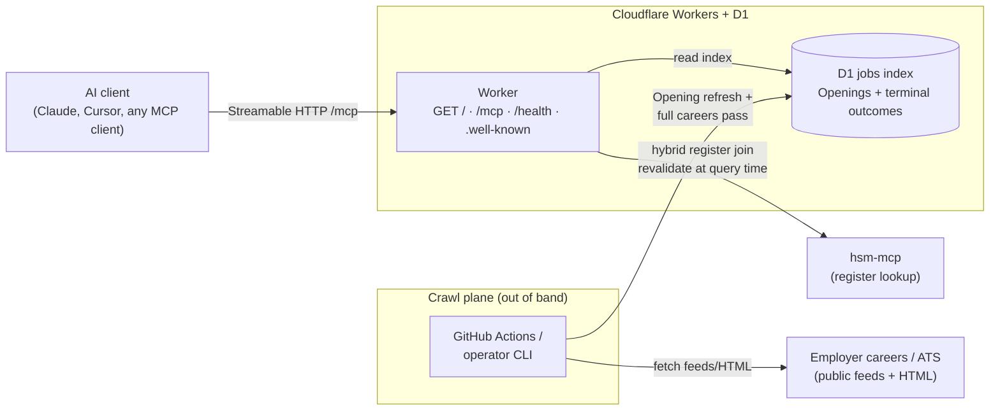

# Developer and operator reference

Human-first setup lives in the [root README](../README.md).
This page is for operators and agents.
It covers architecture, the env contract, and CI detail.

## Local / private release (operator)

Run a **private release** on your machine against a **partial index**.
The D1 schema matches **shared release**.
You run crawl and `dev` locally.

Every jobs-tool response must carry **index scope**.
`private-release:verify` checks this.

Attach **both** MCP servers:

- jobs from this project
- register from **hsm-mcp**

**Do not** point your MCP client at `https://hsmjobs.musavvir.work/mcp` for private local use.
Shared `/mcp` returns **503** until a **full careers pass** completes.
Use localhost Streamable HTTP from `wrangler dev` instead.

### Env contract

1. Copy [`.env.example`](../.env.example) to `.env`.
2. Fill Cloudflare bootstrap keys for deploy.
3. Keep private-release keys at their local defaults unless you need to change them.

| Variable | Default | Purpose |
| -------- | ------- | ------- |
| `JOBS_INDEX_TARGET` | `local-d1` | Where crawl writes the **jobs index**: `local-d1` (private release), `remote-d1` (shared D1 the Worker reads), or `sqlite:<path>` |
| `CLOUDFLARE_ACCOUNT_ID` | — | Required when `JOBS_INDEX_TARGET=remote-d1` (from Cloudflare dashboard) |
| `D1_DATABASE_ID` | — | Required when `JOBS_INDEX_TARGET=remote-d1` (same UUID as `wrangler.jsonc` / bootstrap) |
| `CLOUDFLARE_API_TOKEN` | — | Required when `JOBS_INDEX_TARGET=remote-d1` (D1 edit token) |
| `JOBS_INDEX_LOCAL_D1_STATE` | `.wrangler/state` | Wrangler `--persist-to` root (project-relative path to local D1 persistence) |
| `PRIVATE_RELEASE_ORIGIN` | `http://127.0.0.1:8787` | Base URL for verify and for wiring your MCP client |
| `PRIVATE_RELEASE_PORT` | `8787` | Local dev port (`private-release:integration` may pick a free port when unset) |
| `CRAWL_MAX_ATTEMPTS` | (all missing) | Optional cap on missing KvKs per `crawl:full-pass` invocation |
| `HSM_MCP_ORIGIN` | `https://hsm.codealan.com` | **hsm-mcp** origin for production register load |
| `SHARED_RELEASE_ORIGIN` | `https://hsmjobs.musavvir.work` | Base URL for `shared-release:verify` |

The operator loop reuses `.wrangler/state` unless you set `JOBS_INDEX_LOCAL_D1_STATE`.
CI uses an **ephemeral** state dir under the OS temp folder.
CI deletes that dir after verify.

### Operator loop (crawl → dev → verify)

```bash
npm ci
npm run crawl                  # live fetch → local D1 (partial index)
npm run dev                    # wrangler dev — separate terminal
npm run private-release:verify # Streamable HTTP checks on localhost /mcp
```

For a smoke crawl with no live network, run `npm run crawl:smoke`.
For a full careers pass smoke (fixture register, no live network), run `npm run crawl:full-pass:smoke`.

For one automated loop (crawl → ephemeral D1 → `dev` → verify → teardown), run `npm run private-release:integration`.

### CI verification

Every PR runs the live private-release loop in [`.github/workflows/private-release-integration.yml`](../.github/workflows/private-release-integration.yml).
That workflow runs `npm run private-release:integration`.

After `dev` is up, run `npm run private-release:verify` locally.
That command runs the same checks CI runs against `/mcp`.

## Shared release (operator runbook)

This section is the operator source of truth for **shared release**.
Do not rely on chat history.

1. Drive the production **full careers pass** into the shared D1 **jobs index**.
2. Verify the public origin.
3. Only then point MCP clients at the public URL.

### Prerequisites

- `.env` from [`.env.example`](../.env.example) with Cloudflare bootstrap keys filled (`CLOUDFLARE_ACCOUNT_ID`, `D1_DATABASE_ID`, `CLOUDFLARE_API_TOKEN`)
- Network reachability to **hsm-mcp** (default `https://hsm.codealan.com`; override with `HSM_MCP_ORIGIN`)
- Optional: `CRAWL_MAX_ATTEMPTS` for chunked batches (see Stop / resume / progress)

### Remote D1 jobs index

Production crawl writes must use the same Cloudflare D1 database the Worker reads.

```bash
JOBS_INDEX_TARGET=remote-d1 npm run crawl:full-pass
```

Crawl JSON includes `jobs_index_target: "remote-d1"`.
The runner applies remote D1 migrations on first writable connect.
Local private release keeps `JOBS_INDEX_TARGET=local-d1` (default).

### Live register and website resolution

Non-smoke `npm run crawl:full-pass` loads the current Work register through **hsm-mcp**.
It does not use the Rentman fixture or the GitHub mirror.

**Website resolution** uses real Wikidata lookup and HTTPS page fetch before the **extraction ladder**.

Smoke mode (`CRAWL_SMOKE=1` / `npm run crawl:full-pass:smoke`) stays on the fixture register and stub providers for CI.

### Stop / resume / progress

1. **Start** a production batch:

```bash
JOBS_INDEX_TARGET=remote-d1 npm run crawl:full-pass
```

2. **Optional batching** — set `CRAWL_MAX_ATTEMPTS` to cap how many missing KvKs this run attempts (default: all missing). Example:

```bash
CRAWL_MAX_ATTEMPTS=200 JOBS_INDEX_TARGET=remote-d1 npm run crawl:full-pass
```

3. **Stop** safely — send SIGINT (Ctrl+C) or kill the process. Outcomes already written to remote D1 are kept.

4. **Watch live progress** — while a batch runs, the CLI prints `[crawl] …` lines on stderr (register load, bulk missing scan, each website/ladder KvK). After `register loaded`, expect `scanning terminal outcomes (bulk)…` then `batch:` within seconds — not minutes. Network fetches time out after 20 seconds. One stuck host must not freeze the batch forever. If D1 `terminal_careers_outcomes` count stays flat for many minutes with no new `[crawl]` lines, stop and investigate.

5. **Resume** — re-run the same command. The runner skips KvKs that already have a **terminal careers outcome**. It only attempts missing KvKs.

6. **Read progress** from the crawl JSON printed at the end of each run:

| Field | Meaning |
| ----- | ------- |
| `full_pass` | Runner mode (`crawl:full-pass`). **Not** completion — see `index_scope.pass` |
| `missing_terminal_outcomes_before` | Current-register KvKs still lacking a terminal outcome at start |
| `attempted` | How many missing KvKs this invocation tried (respects `CRAWL_MAX_ATTEMPTS`) |
| `missing_terminal_outcomes_after` | Remaining missing KvKs after this run |
| `index_scope.pass` | `partial` until every current-register KvK has a terminal outcome; then `full_careers_pass` |
| `index_scope.register_size` | Full current register size (should be ~full Work register, not the batch cap) |
| `index_scope.sponsors_attempted` | KvKs with a terminal outcome and/or official website so far |
| `jobs_index_target` | Confirms `remote-d1` for production writes |

A healthy capped batch drops missing by about `attempted` (e.g. 12741 → 12541 when `attempted` is 200).
`pass` stays `partial` until missing hits 0 — that is expected mid-run.
After `register loaded`, expect `scanning terminal outcomes (bulk)…` within seconds; a long silence there is a bug, not normal work.

The pass is complete when `missing_terminal_outcomes_after` is `0` and `index_scope.pass` is `full_careers_pass`.

After a **register refresh**, any new KvK without a terminal outcome forces status back to `partial`.
Catch-up uses the same stop/resume commands.

### Unattended loop (local Mac)

Use this when you want capped batches to keep running overnight without restarting by hand.
Run **only one** loop at a time. Two loops writing the same remote D1 fight each other.

1. Start (or reopen) a tmux session, then run the loop.

If `tmux` is missing: `brew install tmux`. Or skip tmux and run `./scripts/full-pass-loop.sh` in a terminal you leave open (`caffeinate` still keeps the Mac awake).

```bash
tmux new -s crawl
./scripts/full-pass-loop.sh
```

If you see `duplicate session: crawl`, the session already exists — do **not** create another. Reattach:

```bash
tmux attach -t crawl
```

If that session is idle after a kill, run `./scripts/full-pass-loop.sh` again inside it. To start clean instead:

```bash
tmux kill-session -t crawl
tmux new -s crawl
./scripts/full-pass-loop.sh
```

2. Detach with `Ctrl+b` then `d`. Reattach later with `tmux attach -t crawl`.
3. Stop safely with `Ctrl+C` in the session, or `tmux kill-session -t crawl`. Outcomes already written to remote D1 are kept.
4. Confirm a single crawl is running: `pgrep -fl 'full-pass-loop|run-crawl'` should show one loop (plus `caffeinate`) and one `run-crawl` / `tsx` pair.
5. Logs go to `.scratch/full-pass-logs/` (gitignored). `[crawl]` progress lines stream live on stderr. After `done:`, expect `writing index snapshot…`, the JSON report, then `closing runtime…` / `batch process exiting` within ~10 seconds. A long silence after `done:` with no snapshot line is a hang — stop and restart the loop (outcomes already in D1 are kept).

Defaults: `CRAWL_MAX_ATTEMPTS=200`, 30s pause between successful batches, 120s backoff after a failed run, abort after 10 consecutive failures. The script wraps itself in `caffeinate -is` on macOS so sleep does not pause the crawl.

| Env | Default | Meaning |
| --- | ------- | ------- |
| `FULL_PASS_LOOP_BATCH` | `200` | Passed as `CRAWL_MAX_ATTEMPTS` |
| `FULL_PASS_LOOP_PAUSE` | `30` | Seconds between successful batches |
| `FULL_PASS_LOOP_FAIL_BACKOFF` | `120` | Seconds after a non-zero crawl exit |
| `FULL_PASS_LOOP_MAX_CONSEC_FAILS` | `10` | Abort threshold for consecutive failures |
| `JOBS_INDEX_TARGET` | `remote-d1` | Production writes (set only if you need another target) |

When `missing_terminal_outcomes_after` is `0`, the loop prints a completion banner and exits. Then run `npm run shared-release:verify` yourself.

Smoke dry-run (fixture register, no remote D1):

```bash
CRAWL_SMOKE=1 FULL_PASS_LOOP_BATCH=1 FULL_PASS_LOOP_PAUSE=0 ./scripts/full-pass-loop.sh
```

### Shared-release verify

After the production **full careers pass** completes on remote D1, verify the public origin before you point MCP clients at it:

```bash
npm run shared-release:verify
```

Default target: `https://hsmjobs.musavvir.work` (override with `SHARED_RELEASE_ORIGIN`).

Checks:

- `GET /health` returns 200 JSON (not degraded)
- `POST /mcp` initialize succeeds (not 503)
- `get_index_status` reports `pass: full_careers_pass`, `omissions_possible: false`, and a plausible `register_size`

Unit tests cover verify logic against a local HTTP handler.
Those tests do not need live network on every PR.

Run `shared-release:verify` against production manually when the crawl finishes.
Soften the root README “Connect to the public site” copy (remove “returns an error until indexed”) only after this verify passes.

## Architecture



| Path | What happens |
| ---- | ------------ |
| `GET /` | Human discovery page (connect, tools, example asks) |
| `GET /.well-known/mcp.json` | MCP server card (SEP-2127-style machine discovery) |
| `GET /.well-known/mcp/server-card.json` | Same server card (SEP-1649 path alias) |
| `/mcp` | Streamable HTTP → `search_jobs` · `get_job` · `get_index_status` |
| `/health` | Coarse operator/CI health (`up` / `degraded` / `stale`) |
| Crawl | scheduled job or operator CLI → D1 (not inside tool calls) |
| Monitoring | `/health` probe + `get_index_status` + alert on repeated crawl failure |

Transport: **Streamable HTTP** (`serverInfo.name`: `hsm-jobs-mcp`).
Optional stdio exists for local/private-release prototypes only.

Hosting: Cloudflare Workers + D1.
The crawl plane uses scheduled GitHub Actions and/or the operator CLI (see [ADR 0009](adr/0009-v1-stack-and-hosting.md)).
