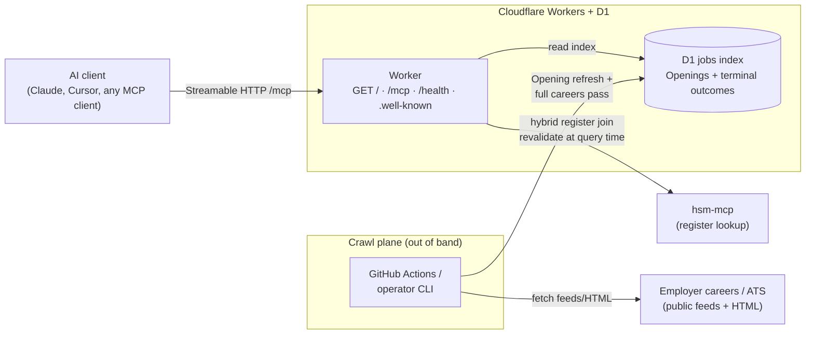

# Developer and operator reference

Human-first setup lives in the [root README](../README.md). This page holds architecture, env contract, and CI detail for operators and agents.

## Local / private release (operator)

Dogfood on your machine against a **partial index** — same D1 schema as shared release, but you run crawl and dev locally. Every jobs-tool response must carry **index scope**; `private-release:verify` checks this. Attach **both** MCP servers: jobs here, register on **hsm-mcp**.

**Do not point your MCP client at `https://hsmjobs.musavvir.work/mcp` for private dogfood.** Shared `/mcp` returns **503** until a **full careers pass** completes. Use localhost Streamable HTTP from `wrangler dev` instead.

### Env contract

Copy [`.env.example`](../.env.example) to `.env`. Cloudflare bootstrap keys are for deploy; private-release keys default for local use.

| Variable | Default | Purpose |
| -------- | ------- | ------- |
| `JOBS_INDEX_TARGET` | `local-d1` | Where crawl writes the jobs index: `local-d1` (private release), `remote-d1` (shared D1 the Worker reads), or `sqlite:<path>` |
| `CLOUDFLARE_ACCOUNT_ID` | — | Required when `JOBS_INDEX_TARGET=remote-d1` (from Cloudflare dashboard) |
| `D1_DATABASE_ID` | — | Required when `JOBS_INDEX_TARGET=remote-d1` (same UUID as `wrangler.jsonc` / bootstrap) |
| `CLOUDFLARE_API_TOKEN` | — | Required when `JOBS_INDEX_TARGET=remote-d1` (D1 edit token) |
| `JOBS_INDEX_LOCAL_D1_STATE` | `.wrangler/state` | Wrangler `--persist-to` root (project-relative path to local D1 persistence) |
| `PRIVATE_RELEASE_ORIGIN` | `http://127.0.0.1:8787` | Base URL for verify and for wiring your MCP client |
| `PRIVATE_RELEASE_PORT` | `8787` | Local dev port (`private-release:integration` may pick a free port when unset) |
| `CRAWL_MAX_ATTEMPTS` | (all missing) | Optional cap on missing KvKs per `crawl:full-pass` invocation |
| `HSM_MCP_ORIGIN` | `https://hsm.codealan.com` | **hsm-mcp** origin for production register load |
| `SHARED_RELEASE_ORIGIN` | `https://hsmjobs.musavvir.work` | Base URL for `shared-release:verify` |

Operator loop reuses `.wrangler/state` unless you override `JOBS_INDEX_LOCAL_D1_STATE`. CI uses an **ephemeral** state dir (temp under the OS tmp) and tears it down after verify.

### Operator loop (crawl → dev → verify)

```bash
npm ci
npm run crawl                  # live fetch → local D1 (partial index)
npm run dev                    # wrangler dev — separate terminal
npm run private-release:verify # Streamable HTTP checks on localhost /mcp
```

Smoke/fixture crawl (no live network): `npm run crawl:smoke`. Full careers pass smoke (fixture register, no live network): `npm run crawl:full-pass:smoke`.

One-shot automated loop (crawl → ephemeral D1 → dev → verify → teardown): `npm run private-release:integration`.

### CI verification

Every PR runs the live private-release loop in [`.github/workflows/private-release-integration.yml`](../.github/workflows/private-release-integration.yml) (`npm run private-release:integration`). Use `npm run private-release:verify` locally after `dev` is up — same checks CI runs against `/mcp`.

## Shared release (operator runbook)

Drive the production **full careers pass** into the shared D1 **jobs index**, then verify the public origin before pointing MCP clients at it. Do not rely on chat history — this section is the operator source of truth.

### Prerequisites

- `.env` from [`.env.example`](../.env.example) with Cloudflare bootstrap keys filled (`CLOUDFLARE_ACCOUNT_ID`, `D1_DATABASE_ID`, `CLOUDFLARE_API_TOKEN`)
- Network reachability to **hsm-mcp** (default `https://hsm.codealan.com`; override with `HSM_MCP_ORIGIN`)
- Optional: `CRAWL_MAX_ATTEMPTS` for chunked batches (see Stop / resume / progress)

### Remote D1 jobs index

Production crawl writes must target the same Cloudflare D1 database the Worker reads:

```bash
JOBS_INDEX_TARGET=remote-d1 npm run crawl:full-pass
```

Crawl JSON includes `jobs_index_target: "remote-d1"`. The runner applies remote D1 migrations on first writable connect. Local private release keeps `JOBS_INDEX_TARGET=local-d1` (default).

### Live register and website resolution

Non-smoke `npm run crawl:full-pass` loads the current Work register through **hsm-mcp** (not the Rentman fixture or GitHub mirror). Website resolution uses real Wikidata lookup and HTTPS page fetch before the **extraction ladder**. Smoke mode (`CRAWL_SMOKE=1` / `npm run crawl:full-pass:smoke`) stays on the fixture register and stub providers for CI.

### Stop / resume / progress

1. **Start** a production batch:

```bash
JOBS_INDEX_TARGET=remote-d1 npm run crawl:full-pass
```

2. **Optional batching** — set `CRAWL_MAX_ATTEMPTS` to cap how many missing KvKs this invocation attempts (default: all missing). Example:

```bash
CRAWL_MAX_ATTEMPTS=200 JOBS_INDEX_TARGET=remote-d1 npm run crawl:full-pass
```

3. **Stop** safely — send SIGINT (Ctrl+C) or kill the process. Outcomes already written to remote D1 are kept.

4. **Resume** — re-run the same command. The runner skips KvKs that already have a **terminal careers outcome**; only missing KvKs are attempted.

5. **Read progress** from the crawl JSON printed at the end of each run:

| Field | Meaning |
| ----- | ------- |
| `missing_terminal_outcomes_before` | Current-register KvKs still lacking a terminal outcome at start |
| `attempted` | How many missing KvKs this invocation tried (respects `CRAWL_MAX_ATTEMPTS`) |
| `missing_terminal_outcomes_after` | Remaining missing KvKs after this run |
| `index_scope.pass` | `partial` until every current-register KvK has a terminal outcome; then `full_careers_pass` |
| `jobs_index_target` | Confirms `remote-d1` for production writes |

When `missing_terminal_outcomes_after` is `0` and `index_scope.pass` is `full_careers_pass`, the pass is complete. After a **register refresh**, any new KvK without a terminal outcome forces status back to `partial`; catch-up reuses the same stop/resume commands.

### Shared-release verify

After the production **full careers pass** completes on remote D1, verify the public origin before pointing MCP clients at it:

```bash
npm run shared-release:verify
```

Default target: `https://hsmjobs.musavvir.work` (override with `SHARED_RELEASE_ORIGIN`). Checks:

- `GET /health` returns 200 JSON (not degraded)
- `POST /mcp` initialize succeeds (not 503)
- `get_index_status` reports `pass: full_careers_pass`, `omissions_possible: false`, and a plausible `register_size`

Unit tests cover verify logic against a local HTTP handler — no live-network dependency on every PR. Run `shared-release:verify` against production manually when the crawl finishes. Soften the root README “Connect to the public site” copy (remove “returns an error until indexed”) only after this verify passes.

## Architecture



| Path | What happens |
| ---- | ------------ |
| `GET /` | Human discovery page (connect, tools, example asks) |
| `GET /.well-known/mcp.json` | MCP server card (SEP-2127-style machine discovery) |
| `GET /.well-known/mcp/server-card.json` | Same server card (SEP-1649 path alias) |
| `/mcp` | Streamable HTTP → `search_jobs` · `get_job` · `get_index_status` |
| `/health` | Coarse operator/CI health (`up` / `degraded` / `stale`) |
| Crawl | scheduled job or operator CLI → D1 (not inside tool calls) |
| Monitoring | `/health` probe + `get_index_status` + alert on repeated crawl failure |

Transport: **Streamable HTTP** (`serverInfo.name`: `hsm-jobs-mcp`). Optional stdio exists for local/private-release prototypes only.

Hosting: Cloudflare Workers + D1; crawl plane via scheduled GitHub Actions and/or operator CLI (see [ADR 0009](adr/0009-v1-stack-and-hosting.md)).
